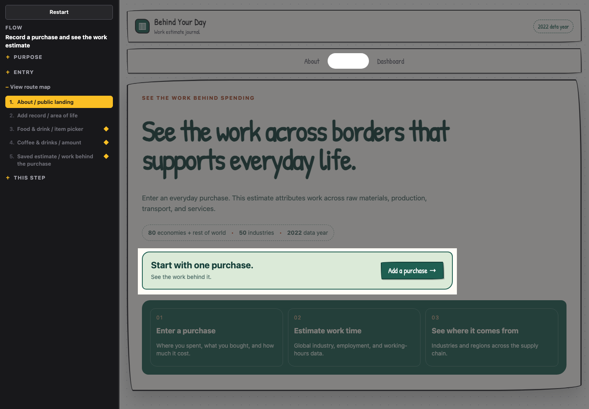

# Flow Alignment

Two agent skills for turning a proposed or researched user journey into a
clickable, low-fidelity artifact that a team can walk together before committing
to design or engineering.

Repository: [C-ZW/flow-alignment](https://github.com/C-ZW/flow-alignment)

The artifact is not a product demo and does not prove that a journey is correct.
It makes the declared route concrete enough for the people responsible for it to
correct an entry point, branch, transition, outcome, or unsupported assumption.

## Quick install

Claude Code:

```bash
claude plugin marketplace add C-ZW/flow-alignment
claude plugin install flow-alignment@flow-alignment
```

Codex CLI:

```bash
codex plugin marketplace add C-ZW/flow-alignment
codex plugin add flow-alignment@flow-alignment
```

Start a new Claude Code session or Codex thread after installation. See
[Installation](#installation) for prerequisites, updates, removal, and local
development.

## Skills

| Skill | Input | Output |
| --- | --- | --- |
| [`website-flow-reference`](.claude/skills/website-flow-reference/SKILL.md) | A permitted public URL | Evidence-backed IA, screenshots, observed journeys, and limitations under `references/<site-key>/` |
| [`flow-alignment-prototype`](.claude/skills/flow-alignment-prototype/SKILL.md) | A proposed flow or researched journey | A standalone clickable wireframe, flow specification, and walkthrough under `prototypes/<flow-name>/` |

Use either skill independently or chain them:

```text
public URL
   │
   ▼
website-flow-reference ── observed evidence and explicit gaps
   │
   ▼
flow-alignment-prototype ── clickable alignment artifact
```

Research gaps are not silently resolved during adaptation. Partial or inferred
claims remain recorded in `flow.json` and travel into the facilitator
walkthrough.

For long live-site runs, finish and validate the reference first, then hand its
selected journey to a fresh agent or session for prototype authoring. The two
skills remain independently usable, and this boundary avoids carrying raw
browser history and unrelated captures into the build phase.

## Demo

Behind Your Day is an owner-authorized example of the complete
research-to-alignment workflow. The image below is a neutral prototype render,
not a source-site screenshot.

| Behind Your Day · purchase-to-work estimate |
| :--- |
| [](https://c-zw.github.io/flow-alignment/) |
| **Observed route**<br>About → Add a purchase → Food & drink → Coffee & drinks → enter `$12 USD` → save the estimate |
| **Evidence boundary**<br>One representative purchase branch was observed on desktop and mobile. Other categories and the Dashboard follow-on remain outside this selected journey. |
| [Live prototype](https://c-zw.github.io/flow-alignment/) · [Flow](prototypes/behind-your-day-purchase/flow.json) · [Walkthrough](prototypes/behind-your-day-purchase/walkthrough.md)<br>[Reference](references/behind-your-day/reference.json) · [Evidence](references/behind-your-day/evidence.md) · [Adaptation](prototypes/behind-your-day-purchase/adaptation.json) |

### Case manifest

This table is the compact, agent-readable index of the same gallery.

| Case ID | Source | Journey ID | Flow ID | Primary limitation |
| --- | --- | --- | --- | --- |
| `behind-your-day-purchase` | `references/behind-your-day/reference.json` | `journey-record-purchase` | `behind-your-day-purchase` | Only one purchase category and item were walked end to end |

Each `reference.json` is the evidence index. Each `flow.json` is the prototype's
source of truth. Read those files before treating the Markdown summaries as
authoritative.

## How the artifact works

`flow.json` declares:

- the entry point, its basis, and skipped preconditions;
- focus screens and the five-part review ledger;
- states, transitions, navigation routes, branches, and outcome postconditions;
- one focused product region, or up to three separated regions that belong to
  the same decision;
- responsive alternatives when a breakpoint changes the action graph.

`prototype.html` embeds the identical object and keeps three responsibilities
separate:

| Area | Responsibility |
| --- | --- |
| Flow navigator | Restart, flow selector, purpose, entry declaration, direct-jump route map, and step note |
| Product viewport | Believable product content and declared business actions |
| Product shell | Product chrome and only the navigation routes declared for the current state |

A mask covers everything outside the current state's declared focus. The route
map may jump directly to any state for discussion, but a jump does not prove the
skipped transitions; every branch must still be walked through product actions.
Feedback is given to the agent, which updates `flow.json` and affected views,
validates them, and re-walks the route.

## Installation

Installation requires Git and a current Claude Code or Codex CLI. Running the
skills also requires:

- Python 3.10 or later; deterministic validators and tests use only the standard
  library;
- a browser or capture-capable agent for website research and desktop/narrow
  walkthroughs;
- optional Python Playwright plus its Chromium browser for the mechanical
  runtime audit. Without it, the same browser walk remains a manual gate.

### Claude Code

Add the published marketplace and install the plugin:

```bash
claude plugin marketplace add C-ZW/flow-alignment
claude plugin install flow-alignment@flow-alignment
```

Start a new Claude Code session after installation. Invoke
`/flow-alignment:website-flow-reference` or
`/flow-alignment:flow-alignment-prototype`, or describe a matching task and
let Claude select the skill.

Update the marketplace snapshot and installed plugin:

```bash
claude plugin marketplace update flow-alignment
claude plugin update flow-alignment@flow-alignment
```

Remove the plugin and marketplace:

```bash
claude plugin uninstall flow-alignment@flow-alignment
claude plugin marketplace remove flow-alignment
```

See the official [Claude Code plugin installation documentation](https://code.claude.com/docs/en/discover-plugins)
and [marketplace documentation](https://code.claude.com/docs/en/plugin-marketplaces).

### Codex CLI

Add the published marketplace and install the plugin:

```bash
codex plugin marketplace add C-ZW/flow-alignment
codex plugin add flow-alignment@flow-alignment
```

Start a new Codex thread after installation. The plugin bundles both skills and
they can be invoked independently or chained.

Refresh the Git marketplace snapshot, then reinstall the cached plugin:

```bash
codex plugin marketplace upgrade flow-alignment
codex plugin remove flow-alignment@flow-alignment
codex plugin add flow-alignment@flow-alignment
```

Remove the plugin and local marketplace registration with:

```bash
codex plugin remove flow-alignment@flow-alignment
codex plugin marketplace remove flow-alignment
```

See the official [OpenAI plugin documentation](https://learn.chatgpt.com/docs/plugins)
and [plugin packaging and marketplace documentation](https://developers.openai.com/plugins/build/plugins).

### Local development

Clone the repository and work from its root:

```bash
gh repo clone C-ZW/flow-alignment
cd flow-alignment
```

Claude Code discovers the canonical skills under `.claude/skills/` when a new
session starts in the checkout. To exercise the packaged marketplace instead,
register `./` as the marketplace source with either CLI; do not replace `./` with
the `.claude-plugin/`, `.agents/`, or `plugins/flow-alignment/` subdirectory.

```bash
# Claude Code, local to this checkout
claude plugin marketplace add ./ --scope local
claude plugin install flow-alignment@flow-alignment --scope local

# Codex CLI
codex plugin marketplace add ./
codex plugin add flow-alignment@flow-alignment
```

## Ask an agent

Build from a proposed journey:

```text
Use flow-alignment-prototype to turn this checkout-recovery journey into a
clickable alignment artifact.
```

Research and adapt a public route:

```text
Use website-flow-reference on https://example.com, then use
flow-alignment-prototype in visual-reference mode to build one observed
journey as a reference-shaped wireframe.
```

Generated files belong at the root of the project in which the agent is running:

```text
references/<site-key>/
  reference.json
  ia.md
  journeys.md
  evidence.md
  screenshots/

prototypes/<flow-name>/
  flow.json
  authoring/
    product-shell.html
    state-views.html
    product.css
  prototype.html
  walkthrough.md
  adaptation.json       # only for website-derived flows
```

Artifacts open directly from disk. They require no backend, build step,
analytics, or external product API. Google Fonts is the only optional remote
resource; local fallbacks keep the artifact functional offline.

Research only permitted public surfaces. Do not bypass authentication, paywalls,
CAPTCHAs, access controls, site terms, or robots guidance.

## Validate

Validate the distributable plugin, every checked-in example, and the complete
test suite with one command:

```bash
python3 scripts/validate_repository.py
```

CI runs the same command on Python 3.10 through 3.14. Individual commands are
useful while authoring one artifact:

```bash
# Website research
python3 .claude/skills/website-flow-reference/scripts/validate_reference.py \
  references/<site-key>/reference.json

# Build from product-owned fragments; never edit prototype.html directly
python3 .claude/skills/flow-alignment-prototype/scripts/build_prototype.py \
  prototypes/<flow-name>

# One-command deterministic handoff gate
python3 .claude/skills/flow-alignment-prototype/scripts/validate_handoff.py \
  prototypes/<flow-name>

# Optional real-browser audit at 1440x1000 and 390x844
python3 .claude/skills/flow-alignment-prototype/scripts/audit_runtime.py \
  prototypes/<flow-name>

# Or include the runtime audit in the handoff gate
python3 .claude/skills/flow-alignment-prototype/scripts/validate_handoff.py \
  prototypes/<flow-name> --runtime

# Clickable prototype
python3 .claude/skills/flow-alignment-prototype/scripts/validate_flow_spec.py \
  prototypes/<flow-name>/flow.json \
  prototypes/<flow-name>/prototype.html

# Website-to-prototype handoff
python3 .claude/skills/flow-alignment-prototype/scripts/validate_adaptation.py \
  prototypes/<flow-name>/adaptation.json \
  references/<site-key>/reference.json \
  prototypes/<flow-name>/flow.json

# Complete repository suite
python3 -m unittest discover -s tests
```

Deterministic validators check declared structure: graph reachability, entry/focus semantics,
actions, branch shape, outcomes, review coverage, evidence links, HTML/spec
agreement, network restrictions, and tooling/product separation.

The optional Playwright audit opens the artifact from disk, walks every declared
transition and route-map jump, exercises Restart, and checks action reachability,
horizontal overflow, mask and spotlight geometry, and browser errors. Install it
with `python3 -m pip install playwright && python3 -m playwright install chromium`
when your runner does not already provide it.

Neither check can determine whether the real journey begins elsewhere, whether an
unmodelled branch exists, or whether people can use the design successfully.
After validation, a person must still inspect whether the screens read like the
product and whether an evidence-shaped wireframe preserves the right hierarchy.

## Repository layout

```text
.claude/skills/                  canonical skill sources
  flow-alignment-prototype/
  website-flow-reference/
plugins/flow-alignment/        generated Claude Code and Codex plugin bundle
.agents/plugins/                Codex marketplace manifest
.claude-plugin/                 Claude Code marketplace manifest
scripts/                        packaging helpers
prototypes/                     generated clickable artifacts
references/                     generated website research
tests/                          contract and artifact validation
PROJECT_GOALS.md                scope, claims, and non-goals
AGENTS.md                       repository contribution rules
THIRD_PARTY_NOTICES.md          source-capture ownership and redistribution notice
SECURITY.md                     private vulnerability-reporting policy
CHANGELOG.md                    release history
```

Read [PROJECT_GOALS.md](PROJECT_GOALS.md) for what an artifact can establish and
what it must not claim. Read [AGENTS.md](AGENTS.md) before changing skills,
templates, validators, or generated artifacts.

## Contributing

Edit only `.claude/skills/`. The shared plugin bundle is generated:

```bash
python3 scripts/sync_plugin_skills.py
python3 scripts/sync_prototype_template.py
python3 scripts/sync_plugin_skills.py --check
python3 scripts/sync_prototype_template.py --check
python3 -m unittest discover -s tests
```

Then run relevant artifact validators, walk every branch at desktop and narrow
widths, and regenerate case previews after changing the shared template or a
gallery artifact. Errors block handoff; warnings must be resolved or explained.

## License

The project code, skills, neutral prototype artwork, and documentation are
released under the [MIT License](LICENSE). Public-site research screenshots are
excluded from that grant; see [Third-party notices](THIRD_PARTY_NOTICES.md) for
their provenance and redistribution guidance. They are research evidence, not
MIT-licensed prototype assets. If your public distribution cannot include those
captures, omit `references/*/screenshots/`; the skills and generic wireframe
mode remain usable without them.
